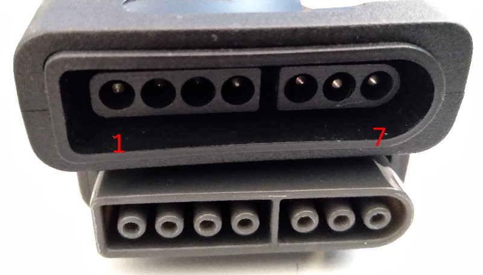
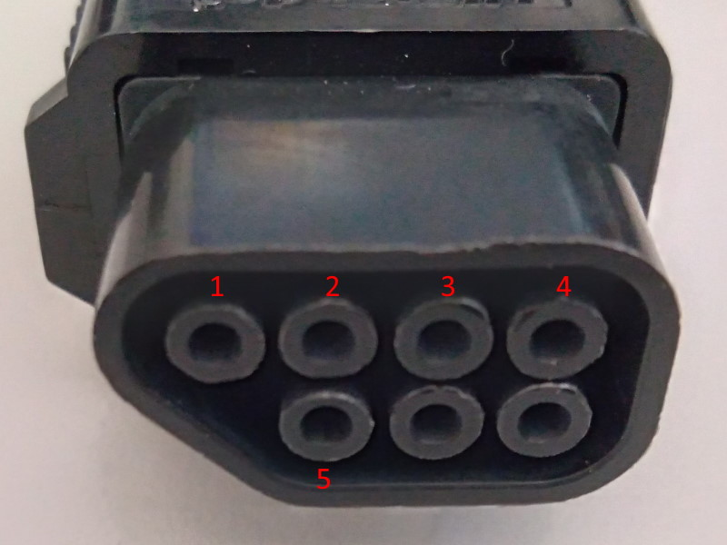
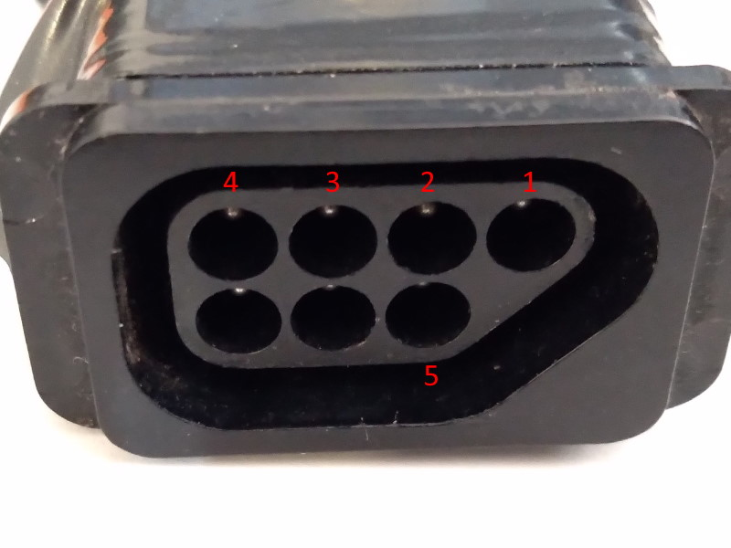

## Snes Mode

Serial ID is RZordSnes

More info at [SnesLib](https://github.com/sonik-br/SnesLib).

#### Snes button mapping

| Snes   | HID | PS3     |
|--------|-----|---------|
| D-PAD  | HAT | D-PAD   |
| B      | 1   | X       |
| A      | 2   | O       |
| Y      | 0   | &#9723; |
| X      | 3   | &#9651; |
| L      | 4   | L1      |
| R      | 5   | R1      |
| Select | 8   | Select  |
| Start  | 9   | Start   |

#### Nes button mapping

| Snes   | HID | PS3     |
|--------|-----|---------|
| D-PAD  | HAT | D-PAD   |
| B      | 1   | X       |
| A      | 2   | O       |
| Select | 8   | Select  |
| Start  | 9   | Start   |

## Arduino Leonardo pin mapping

##### If using Snes connector

| Arduino     | SNES     | Other        |
|-------------|----------|--------------|
| GND         | 7        |              |
| 5V          | 1        |              |
| 8           | 2 - CLK  |              |
| 9           | 3 - LAT  |              |
| 10          | 4 - DAT1 |              |
| A0          | 5 - DAT2 | **Optional** |
| 14          | 6 - SEL  | **Optional** |

| 1 2 3 4 | 5 6 7 )

##### If using Nes connector

| Arduino     | NES      |
|-------------|----------|
| GND         | 1        |
| 8           | 2 - CLK  |
| 9           | 3 - LAT  |
| 10          | 4 - DAT1 |
| 5V          | 5        |

##### Snes Multitap

For optional snes multitap support also connect the DATA2 and SELECT pins and uncomment `SNES_ENABLE_MULTITAP` on `SnesLib.h`. 
Note that most of the controller extension cables does not have those pins and can't be used for multitap.
