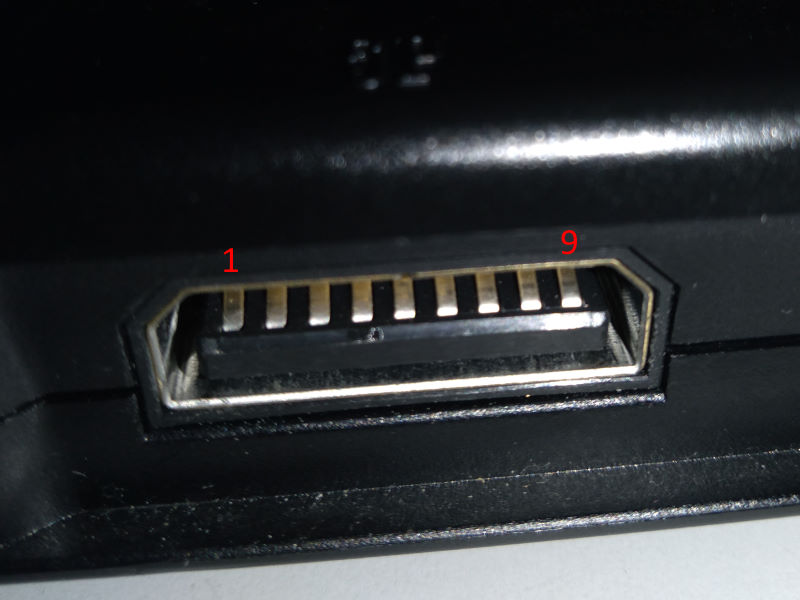
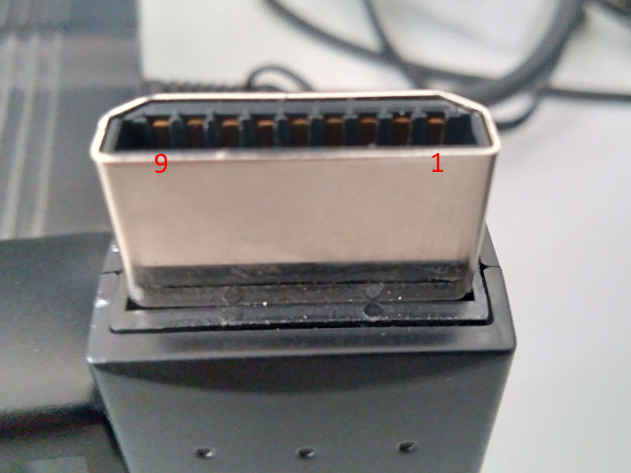

## Saturn / Megadrive Mode

Serial ID is RZordSat

More info at [SaturnLib](https://github.com/sonik-br/SaturnLib).

#### Saturn / Megadrive button mapping

| Saturn | HID | PS3     | Megadrive          |
|--------|-----|---------|--------------------|
| D-PAD  | HAT | D-PAD   |                    |
| A      | 1   | X       |                    |
| B      | 2   | O       |                    |
| C      | 5   | R1      |                    |
| X      | 0   | &#9723; |                    |
| Y      | 3   | &#9651; |                    |
| Z      | 4   | L1      |                    |
| L      | 6   | L2      | "Home" on M30 2.4G |
| R      | 7   | R2      | Mode               |
| Start  | 9   | Start   |                    |

## Arduino Leonardo pin mapping

If using Saturn connector

| Arduino     | Saturn-1 | Saturn-2 |
|-------------|----------|----------|
| GND         | 9        | 9        |
| 5V          | 1        | 1        |
| A0          | 7        |          |
| A1          | 6        |          |
| A2          | 4        |          |
| A3          | 8        |          |
| A4          | 3        |          |
| A5          | 2        |          |
| 2           |          | 3        |
| 3           |          | 2        |
| 4           |          | 8        |
| 5           |          | 6        |
| 6           |          | 7        |
| 7           | 5        |          |
| 8           |          | 4        |
| 9           |          | 5        |

If using Megadrive DB9 connector

| Arduino     | Mega-1   | Mega-2   |
|-------------|----------|----------|
| GND         | 8        | 8        |
| 5V          | 5        | 5        |
| A0          | 4        |          |
| A1          | 6        |          |
| A2          | 7        |          |
| A3          | 3        |          |
| A4          | 1        |          |
| A5          | 2        |          |
| 2           |          | 1        |
| 3           |          | 2        |
| 4           |          | 3        |
| 5           |          | 6        |
| 6           |          | 4        |
| 7           | 9        |          |
| 8           |          | 7        |
| 9           |          | 9        |

#### MegaDrive to Saturn pin mapping

Build this simple adapter if you use a Saturn connector and want to use Megadrive controller. 
This adapter will also work on the Saturn console with some games.

| Saturn  | Mega DB9 | Description |
|---------|----------|-------------|
| 1       | 5        | VCC/POWER   |
| 2       | 2        | D1/DATA 1   |
| 3       | 1        | D0/DATA 0   |
| 4       | 7        | S0/SEL/TH   |
| 5       | 9        | S1/REQ/TR   |
| 6       | 6        | S2/ACK/TL   |
| 7       | 4        | D3/DATA 3   |
| 8       | 3        | D2/DATA 2   |
| 9       | 8        | GROUND      |